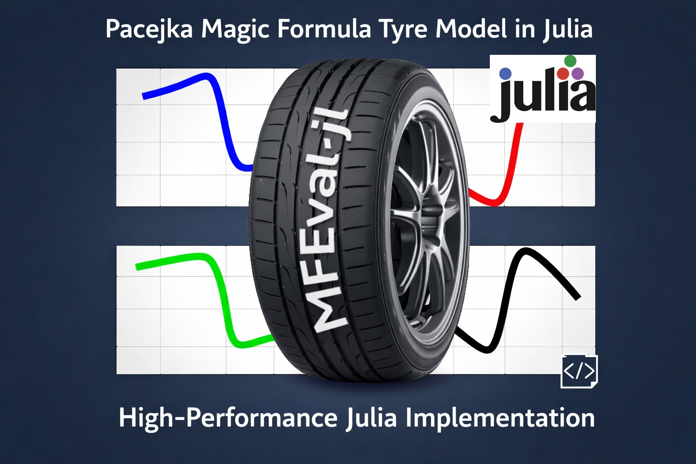

<div align="center">
  
  
  # MFeval.jl
  
  **High-Performance Pacejka Magic Formula Tyre Model Implementation in Julia**
  
  [](https://julialang.org/)
  [](#license)
  [](#installation--testing)
  [](#performance-benchmarks)

</div>

## Overview

MFeval.jl is a high-performance Julia implementation of the **Pacejka Magic Formula** tyre model, supporting MF versions 5.2, 6.1, and 6.2. Originally reimplemented from Marco Furlan's MATLAB [mfeval toolbox](https://uk.mathworks.com/matlabcentral/fileexchange/63618-mfeval), this package delivers:

- **🚀 Sub-microsecond evaluation** — Target < 1 µs per tyre evaluation
- **🔧 Zero allocations** — Allocation-free scalar hot path
- **⚡ Multithreading** — Built-in parallel batch processing
- **📊 Full MF coverage** — All 30 output variables (forces, moments, geometry, relaxation)
- **🎯 Extensive validation** — 611 tests including regression against MATLAB reference

## Quick Start

### Installation

```julia
using Pkg
Pkg.add(url="https://github.com/matheusft/MFeval_julia.git")
```

### Basic Usage

```julia
using MFeval

# Load tyre parameters from TIR file
params = read_tir("path/to/tyre_parameters.tir")

# Single evaluation
inputs = MFInputs(Fz=4000.0, kappa=0.1, alpha=0.05, gamma=0.0, phit=0.0, Vx=50.0)
result = mfeval(params, inputs, MFModes(111))

println("Fx = $(result.Fx) N, Fy = $(result.Fy) N")

# Batch evaluation (multithreaded)
input_matrix = [4000.0 0.1 0.05 0.0 0.0 50.0;  # Fz κ α γ φ Vx
                4000.0 0.2 0.03 0.0 0.0 50.0]
results = mfeval(params, input_matrix, MFModes(111))  # N×30 output matrix
```

## Features

### Supported MF Versions
- **MF 5.2** — Original Pacejka formulation
- **MF 6.1** — Enhanced with pressure and inflation effects  
- **MF 6.2** — Advanced with iterative effective rolling radius (Rl) solver

### Output Variables (30 total)
Forces and moments: `Fx`, `Fy`, `Fz`, `Mx`, `My`, `Mz`  
Input echoes: `kappa`, `alpha`, `gamma`, `phit`, `Vx`, `pressure`  
Geometry: `Re`, `rho`, `two_a`, `t`, `omega`, `Rl`, `two_b`  
Coefficients: `mux`, `muy`, `Cx`, `Cy`, `Cz`, `Kya`, `sigmax`, `sigmay`, `inst_Kya`, `Kxk`  
Residual: `Mzr`

### Performance Benchmarks

| Test | Target | Result | Status |
|------|--------|---------|--------|
| **Scalar evaluation** | < 1 µs | 864 ns (MF6.1) | ✅ |
| **Memory allocations** | 0 allocs | 0 allocs | ✅ |
| **Type stability** | No `Any`/`Union{}` | Clean | ✅ |
| **Thread scaling** | ≥ 50% efficiency | 56% (8 threads) | ✅ |

## Installation & Testing

### Prerequisites
- Julia 1.9+ ([download here](https://julialang.org/downloads/))

### Setup
```bash
git clone https://github.com/matheusft/MFeval_julia.git
cd MFeval_julia
julia --project=. -e 'using Pkg; Pkg.instantiate()'
```

### Run Tests
```bash
# Full test suite (611 tests across 5 phases)
julia --project=. test/runtests.jl

# Performance benchmarks  
julia --project=. --threads=4 test/benchmarks.jl
```

Expected output:
```
============================================================
Phase 1 — Types, I/O and structs         342 tests ✅
Phase 2 — Scalar solver kernels          97 tests ✅  
Phase 3 — Public API                     55 tests ✅
Phase 4 — Validation                     117 tests ✅
============================================================
611 tests, 0 failures
```

## Documentation

### TIR File Format
MFeval.jl reads standard TIR (Tyre Information Resource) files containing Magic Formula parameters:

```julia
# Load parameters
params = read_tir("MagicFormula61_Parameters.tir")

# Inspect loaded version
println("MF version: $(params.fittyp)")  # 61, 52, etc.
```

### Input Modes
Control solver behavior with `MFModes`:

```julia
modes = MFModes(
    useLimitsCheck = true,   # Apply input range limits (1xx)  
    useAlphaStar = true,     # Use α* influence (x1x)
    useTurnSlip = true       # Include turn slip (φ, ψ̇) (xx1)
)

# Common presets:
MFModes(111)  # All features enabled (default)
MFModes(110)  # No turn slip
MFModes(101)  # No alpha star
```

### Advanced Usage

```julia
# Pre-allocate output matrix for batch processing
N = 10000
input_matrix = randn(N, 6)  # Fz κ α γ φ Vx
output_matrix = Matrix{Float64}(undef, N, 30)

# In-place batch evaluation (zero additional allocations)
mfeval!(output_matrix, params, input_matrix, MFModes(111))
```

## References

**Primary Sources:**
- Pacejka, H.B. — *Tyre and Vehicle Dynamics*, 3rd ed., Elsevier, 2012
- Besselink et al. — *An improved Magic Formula/Swift tyre model that can handle inflation pressure changes*, Vehicle System Dynamics, 48:1, 2010. DOI: [10.1080/00423111003748088](https://doi.org/10.1080/00423111003748088)

**MATLAB Reference:**  
Original [mfeval toolbox](https://uk.mathworks.com/matlabcentral/fileexchange/63618-mfeval) by Marco Furlan

## Contributing

Contributions welcome! Please see:
- Run tests: `julia --project=. test/runtests.jl`
- Check performance: `julia --project=. test/benchmarks.jl`
- Follow existing code style and add tests for new features

## License

MIT License - see [LICENSE](LICENSE) file for details.

---

<div align="center">
  <sub>Built with ❤️ for the vehicle dynamics community</sub>
</div>